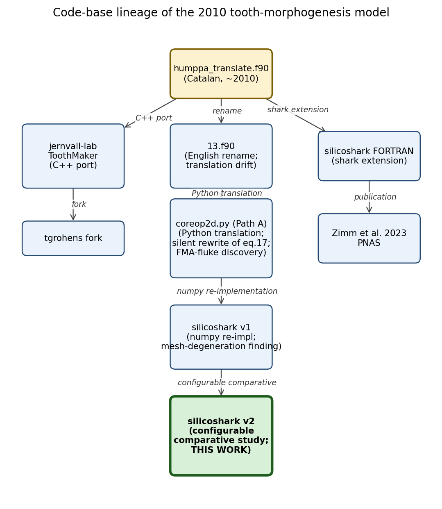
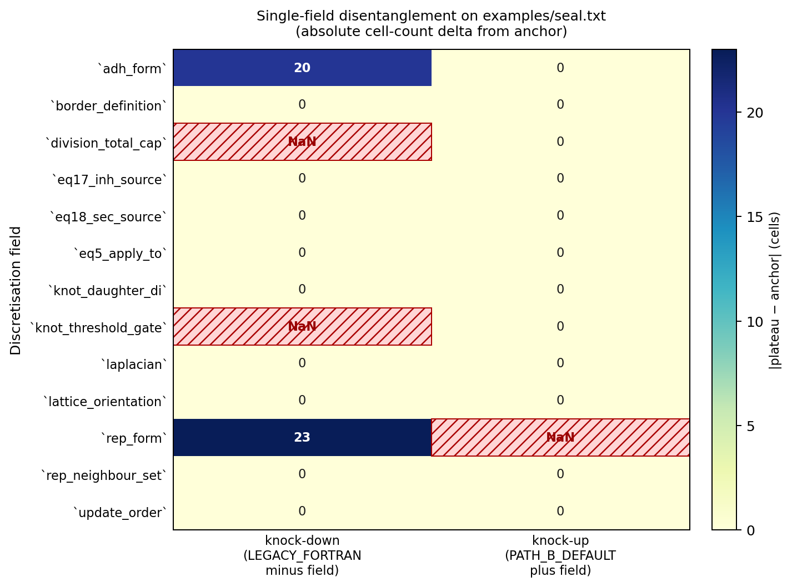
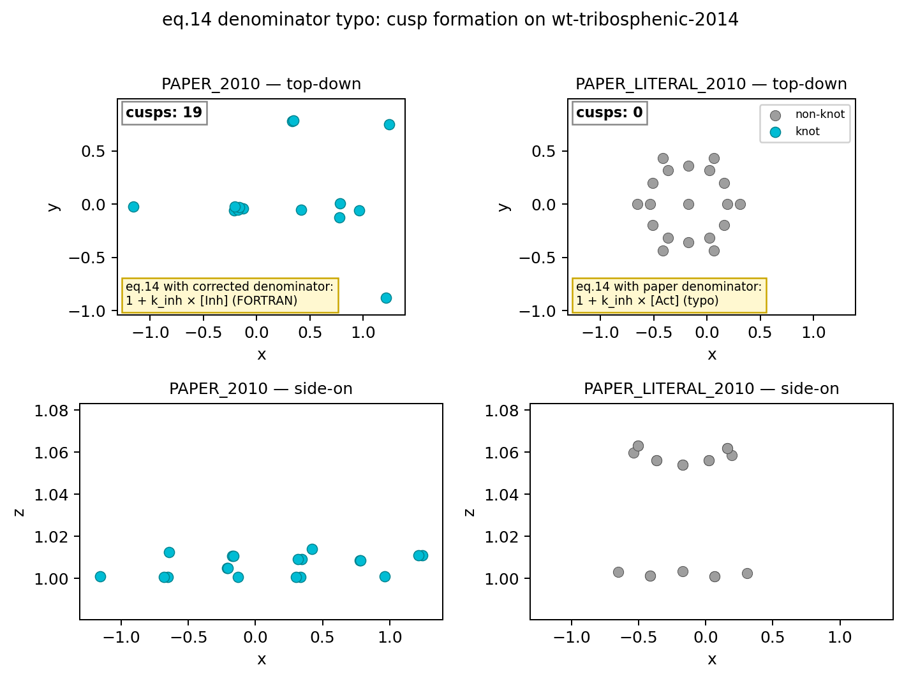
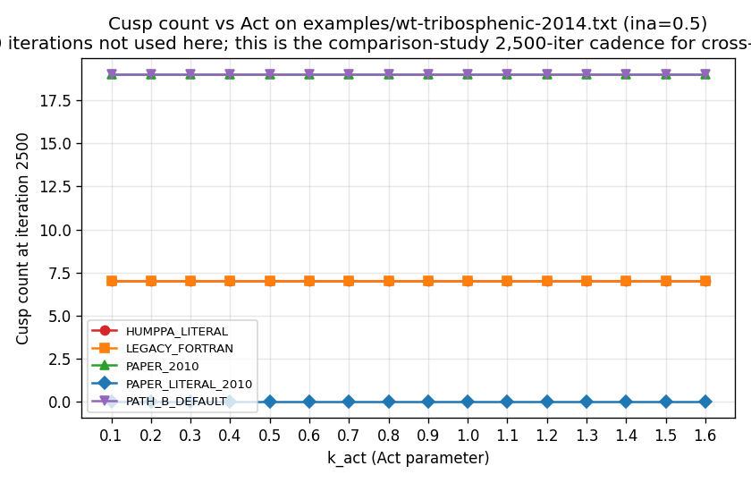
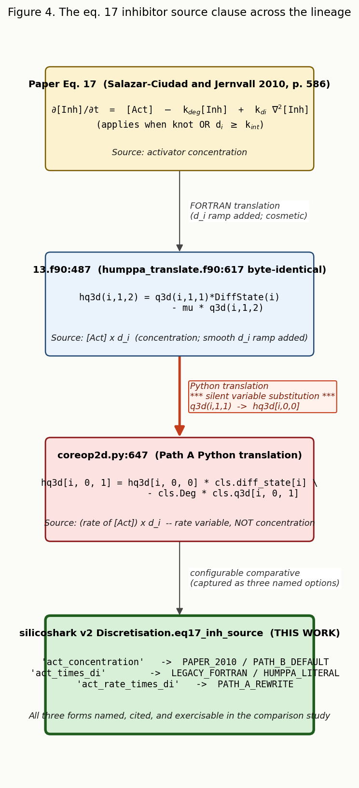

## Abstract

I argue that LLM-assisted analysis can identify, classify, and quantify the implementer-choice points hidden in an under-specified scientific model, with the Salazar-Ciudad and Jernvall 2010 *Nature* tooth-morphogenesis model as a worked example.

I built a configurable Python re-implementation of the 2010 + 2014 mammalian tooth model in which every implementer-choice point is a named field on a single Python dataclass (`Discretisation`), with five named presets representing the canonical configurations (the literal 2010 paper, the paper with a typo corrected, the legacy FORTRAN `13.f90`, the upstream Catalan FORTRAN `humppa`, a clean numpy default, and a Path A rewrite preset that documents one specific drift). Each option is grounded in a paper passage, a FORTRAN line, and where applicable a citation in an alternative code-base. I exercised the presets and per-field perturbations on two parameter files: the seal-example calibration set and the 2014 wild-type tribosphenic mouse parameter set.

Two findings of substance. First, the famous eq. 14 typo in the 2010 paper (printed as `1 + k_Inh [Act]` where the FORTRAN computes `1 + k_Inh [Inh]`) is biologically catastrophic on parameter sets that exercise the activator-inhibitor coupling: the paper-literal denominator produces zero cusps, the FORTRAN-corrected denominator produces nineteen. Second, on the seal example, the FORTRAN's bundle of choices is dominated by two fields (`rep_form` and `adh_form`); most of the other paper-vs-FORTRAN choices are biologically dormant on this metric and parameter set, with mutual-load-bearing exceptions that surface only as NaN failures when one field is removed without its partner. A separate audit caught a previously-unnoticed silent rewrite in a careful human-only translation: Path A's `coreop2d.py` substituted an Act *rate* temporary variable for an Act *concentration* in the eq. 17 source, a divergence no other implementer in the lineage made.

I argue that this case study supports a methodological proposition: AI-assisted comparative analysis sits as a partial bridge between informal paper-prose and executable code — less rigorous than formal specification, more auditable than narrative prose, and more empirically grounded than literate programming because the tests exercise each choice point directly. A consolidated kind × consequence classification table at the head of §The Discretisation taxonomy maps every field to its biological consequence on the parameter sets exercised.

## The problem: paper-vs-code specification gaps in scientific software

Most published scientific models exist in two forms. The first is the paper, which describes the model in informal human language: prose, equations, occasional pseudocode, and a parameter table or two. The second is the code, which is the executable specification — necessarily complete, in the sense that every implementation choice is resolved one way or another, even when the resolution is an accident of how a particular language or compiler handled a particular line. The paper is what the scientific community reads, cites, and interrogates; the code is what actually produced the results.

These two forms can diverge. There is no formal mechanism inside the publication system to detect or quantify the gap. Authors can be unaware of what their own code does at the level of detail that matters for reproducibility; reviewers cannot check what the paper does not state; readers reconcile any tension by judgement.

The formal-specification literature has tools to relate code to mathematically precise specifications (Hoare 1969; Floyd 1967; Leroy 2009 on the CompCert verified C compiler). These tools work well for compilers, kernels, and small safety-critical systems. They are impractical for most real scientific software, where the specification itself is informal and the model itself is the object of inquiry. A developmental-biology paper like the 2010 Salazar-Ciudad and Jernvall tooth-morphogenesis model cannot be formally specified in any tractable sense — the equations are continuous, the discretisation is implicit, the implementation accumulates choices the paper does not name, and the executable artefact survives in multiple forks across multiple languages.

The pragmatic gap is bridged today by trust, expert reading, and implementer intuition. The 'reproducibility crisis' literature has named this gap repeatedly without offering a tractable solution (Baker 2016; Munafò et al. 2017): literate programming asks authors to interleave prose and code (Knuth 1984); FAIR data principles ask for metadata (Wilkinson et al. 2016); community challenges (CASP, DREAM, ISCB) ask for blind reproduction. None directly address the per-line implementer-choice question. Soergel (2015) makes the empirical case that scientific software is errorful at industry rates, and that most published computational results are likely affected by at least one undetected coding bug — a claim the present work treats as a working assumption rather than an opening polemic.

LLM-assisted analysis offers a third option. It does not formalise the specification — that remains impractical. It does not replace expert review — that remains necessary. What it does, well, is enumerate. Given the paper, the code, and any related code-bases, an LLM can systematically catalogue every place where the paper is silent, every place where the paper and the code disagree, and every place where the code carries a feature that no other implementer of the same paper has. The catalogue is not provably exhaustive, but in my experience it is more thorough than any human-only review I have seen.

This work is a case study in that proposition. The subject is a developmental-biology model whose paper is well-known (Salazar-Ciudad and Jernvall 2010), whose canonical FORTRAN code-base is hand-translated from the original Catalan implementation, and whose lineage now includes a C++ port (`jernvall-lab/ToothMaker`), an academic fork (`tgrohens`), a shark-extension fork that produced its own *PNAS* paper (Zimm et al. 2023), and at least two prior translations into Python. This lineage is itself the topic of the methodology: how do we know which of these implementations is correct? More fundamentally, what does 'correct' mean for a code-base whose paper is silent on most of the implementation details?

The methodological claim of this work is that LLM-assisted analysis, applied carefully and disciplined by a clear taxonomy of disagreement-types, can make the implementer-choice surface of a published scientific model visible and auditable. The scientific output is the surface itself: a comprehensive enumeration of choice points, each tied to a paper passage and a FORTRAN line, exercised against measurable biological output (cusp count, cell-count plateau, vertex envelope) on more than one parameter set.

## The model and its lineage

The Salazar-Ciudad and Jernvall 2010 model describes the development of a mammalian tooth as the interaction of three coupled processes: a reaction-diffusion gene network operating on a triangulated mesh of epithelial cells; mechanical forces acting between cells, between an epithelial layer and an underlying mesenchymal layer, and through external biases; and cell division when stretched edges exceed a threshold. The model has eighteen equations across the three processes (the 2010 paper main text and SI). Cells start in a hexagonal initial layout (the paper gives seven cells; later parameter files use nineteen). A feedback loop drives a designated activator species (Act) above a threshold value of one, at which point the cell becomes an 'enamel knot', stops dividing, and secretes signalling factors that modulate its neighbours' growth. The pattern of knots that emerges over time is the developmental signature of the tooth — a single knot for a simple cone, multiple knots for the tribosphenic morphology characteristic of the basal mammalian dentition.

The code-base lineage is non-trivial. It runs as follows:

```
humppa_translate.f90  (Catalan, ~2010)
  |
  +--> 13.f90  (renamed to English, with translation drift)
  |     |
  |     +--> Path A coreop2d.py  (Python translation, with further drift)
  |             |
  |             +--> Path B v1 silicoshark/  (numpy re-implementation; failed)
  |                     |
  |                     +--> Path B v2 silicoshark/  (configurable comparative)
  |
  +--> jernvall-lab/ToothMaker  (C++ port)
  +--> tgrohens/ToothMaker  (academic fork; close to humppa)
  +--> silicoshark FORTRAN  (shark extension; led to Zimm et al. 2023 PNAS)
```



**Figure 1.** Code-base lineage of the tooth-morphogenesis model. The 2010 *Nature* paper of Salazar-Ciudad and Jernvall is implemented in FORTRAN as humppa, then renamed to English (`13.f90`) with one or more translation drifts (§6 documents one such case in eq. 17). Forks include a C++ port (jernvall-lab) which the tgrohens academic fork further forks from, and a shark extension that produced silicoshark FORTRAN and Zimm et al. 2023. Path A's `coreop2d.py` is a faithful Python translation of `13.f90` used as the cross-validation oracle. Path B's silicoshark v1 was a paper-faithful numpy re-implementation that exposed mesh degeneration in the seal example (§5). Path B v2 — this work — makes every implementer-choice point in the lineage a configurable `Discretisation` field, with named presets covering each ancestor's behavioural profile.

A few features of this lineage deserve flagging. There is no canonical implementation: the 2010 paper does not link to a specific repository; the FORTRAN that produced the 2010 results is a fork of an earlier Catalan version (`humppa`); the C++ port does not cover every routine; the Python translations carry their own incremental rewrites. The renaming step from Catalan variable names (`malla`, `vei`, `marge`, `tacre`, `acac`) to English names (`mesh`, `neigh`, `margin`, ...) introduced its own bugs, catalogued at line-by-line resolution in a separate research note. The 2014 paper (Harjunmaa et al. 2014) treats the 2010 model as a black box: it does not alter the equations, but provides a 25-parameter wild-type tribosphenic mouse parameter set in Ext Data Fig. 2 and relies on the FORTRAN code-base to run the model.

The lineage is itself the topic of this methodology paper. Each step in the chain of translations and forks is an opportunity for a silent rewrite. Some such rewrites are biologically inert; some are biologically catastrophic; some sit between. Prior to this work, the lineage was understood in broad strokes but not at the granularity of per-line equivalence. This briefing reports the result of an LLM-assisted line-by-line audit across all five code-bases for every reaction equation and most of the mechanical force routines.

## The Discretisation taxonomy

The conceptual core of this work is the taxonomy of disagreements between paper and code. I argue, following the v2 charter, that every implementer-choice point falls into one of three categories:

1. **PaperAmbiguity.** The paper is silent or sketches the answer in prose without pinning a discrete formula. Multiple options are defensible numpy-idiomatic readings; none is uniquely right.
2. **PaperVsCodeTension.** The paper text and the FORTRAN code disagree, and one side is more credibly the intended model.
3. **FortranAccident.** A `13.f90`-only artefact (a renaming bug, a floating-point fluke, a dead branch). Preserved in the `LEGACY_FORTRAN` preset only for reproducing the FORTRAN goldens, not as a real modelling choice.

The categories are exhaustive by construction (every implementer-choice point that can be named falls into one of the three) but the boundary between them is itself an interpretive judgement. I take up that judgement explicitly below.

### Field classification: kind × biological consequence

The following table cross-classifies every Discretisation field by its kind (from the audit) and its consequence on each parameter set's biology (from §The comparison study). Sorted by kind, then alphabetically.

| Field | Kind | seal.txt | wt-tribosphenic-2014.txt |
|---|---|---|---|
| `border_definition` | PaperAmbiguity | dormant on plateau (envelope shifts) | not measured |
| `division_max_edge` | PaperAmbiguity | not exercised (static topology) | not exercised |
| `division_per_step_cap` | PaperAmbiguity | not exercised (static topology) | not exercised |
| `eq5_z_gate` | PaperAmbiguity | not measured (same in both anchors) | not measured |
| `knot_daughter_di` | PaperAmbiguity | not exercised (no knots form) | not exercised (no division) |
| `laplacian` | PaperAmbiguity | dormant | not measured |
| `rep_form` | PaperAmbiguity | **LOAD-BEARING (100% of span); runaway-on-add** | not measured |
| `topology` | PaperAmbiguity | dormant under `static_with_local_update`; runaway under `delaunay_each_step` (v1) | not measured |
| `adh_form` | PaperVsCodeTension | **LOAD-BEARING (87% of span)** | not measured |
| `diff_accumulator` | PaperVsCodeTension | not exercised (Sec=0 throughout) | LOAD-BEARING (paper presets); not exercised (FORTRAN presets) |
| `eq14_denominator` | PaperVsCodeTension | not exercised (Inh=0 throughout) | **LOAD-BEARING (Δ = 19 cusps)** |
| `eq17_inh_source` | PaperVsCodeTension (with translation drift) | not exercised (clause never fires) | not exercised under FORTRAN presets; not measured under paper presets |
| `eq18_sec_source` | PaperVsCodeTension | not exercised (clause never fires) | LOAD-BEARING under paper presets; not exercised under FORTRAN presets |
| `eq5_apply_to` | PaperVsCodeTension | dormant on plateau (envelope shifts) | not measured |
| `knot_threshold_gate` | PaperVsCodeTension | dormant alone; **runaway-on-removal** when removed from `LEGACY_FORTRAN` bundle | not measured (load-bearing in bundle: PAPER 19 cusps vs FORTRAN 7) |
| `mesenchyme` | PaperVsCodeTension | inert (Inh=Sec=0) | inert under both preset families at 2500 iters (D1) |
| `n_mesenchyme_layers` | PaperVsCodeTension | inert (Inh=Sec=0) | inert across {1, 2, 3} layers under paper presets (D1) |
| `rep_neighbour_set` | PaperVsCodeTension | dormant on plateau (envelope shifts) | not measured |
| `update_order` | PaperVsCodeTension | dormant on plateau (envelope shifts) | not measured |
| `border_bias_x_zero_quirk` | FortranAccident (load-bearing) | load-bearing for FORTRAN-golden z envelope (with `lattice_orientation='fortran'`) | not measured |
| `division_total_cap` | FortranAccident (phenomenological) | dormant alone; **runaway-on-removal** when removed from `LEGACY_FORTRAN` bundle | not exercised (no division) |
| `lattice_orientation` | FortranAccident (load-bearing) | dormant on plateau (envelope shifts) | not measured |

Each row's consequence cell is what changes when the field is varied with all others held fixed at the relevant anchor preset. 'Not exercised' = the parameter set's dynamics never reach the state where the field's branch fires. 'Not measured' = the disentanglement matrix has not been run on this parameter set yet (a natural follow-up; only the five-preset comparison was run on `wt-tribosphenic-2014.txt`).

Three intersections deserve flagging. The PaperAmbiguity × LOAD-BEARING cell (`rep_form` on seal.txt) means a paper that under-specifies it cannot be reproduced from prose alone — and `topology` falls in the same cell once the v1 delaunay-each-step regime is admitted as a valid reading. The PaperVsCodeTension × not-exercised cell (`eq17_inh_source` on seal, and on wt-tribosphenic-2014 under FORTRAN presets) means the tension exists formally but does not move biology on the parameter sets exercised so far — see §5 finding 5 and §The lineage finding for why this is methodologically useful rather than a null result. The FortranAccident × load-bearing cell (`border_bias_x_zero_quirk` on seal, with the matching `lattice_orientation`) is load-bearing for the FORTRAN's own implementation, not for the paper's model: the audit preserves the option for FORTRAN-golden compatibility, and §5 finding 1's z ≈ 600 cluster depends on it. Cross-references back into §The comparison study tie each row's consequence to the numbered findings.

### PaperAmbiguity worked example: the laplacian operator

The paper specifies reaction-diffusion in continuous form. Equation 14 reads `partial[Act] / partial t = k_act [Act] / (1 + k_inh [Inh]) - k_deg [Act] + k_da nabla^2 [Act]`, where `nabla^2` is the spatial Laplacian operator. On a continuous domain this is unambiguous. On the triangulated mesh of cells, however, the discrete Laplacian must be defined, and the paper says only 'finite volume on the triangular mesh, with flux proportional to contact area' (main p. 585). No formula is given.

There are at least three defensible discrete Laplacians:

- **Length-weighted graph Laplacian.** `L u[i] = sum_{j in N(i)} (u[j] - u[i]) / |p_j - p_i|`. The simplest Fick's-law reading. Path B v1 chose this form for its numpy idiomatic clarity. It is not what any FORTRAN code-base in the lineage uses.
- **Cotangent (discrete Laplace–Beltrami) operator.** The textbook discrete Laplacian on triangulated surfaces, weighting each edge by `cot α + cot β` where α and β are the opposing angles in the two triangles sharing the edge (Meyer et al. 2003). Closer to the paper's prose 'flux proportional to contact area' if 'contact area' is read as 'curvature-aware geodesic weighting'. No code-base in the lineage uses it.
- **FORTRAN per-edge margins.** `13.f90`'s `apply_diffusion` walks each edge, computes a `pes` (margin) value from the neighbour `border` array, and applies a per-cell `area_p` weighting that drives vertical diffusion between z-layers. The substrate boundary uses a hand-tuned `0.044D1` coefficient (a load-bearing magic number; see the Path A FMA finding for context). This is what every FORTRAN in the lineage uses.

The paper as written constrains none of these. Each is a legitimate reading. The role of the `Discretisation.laplacian` field is to make the choice explicit: any Path B run names which laplacian it used, and the comparison study can quantify whether the choice matters on a given parameter set.

### PaperVsCodeTension worked example: eq. 14 denominator

The 2010 paper main p. 586 prints the eq. 14 inhibitor saturation term as `1 + k_inh [Act]`. Read literally, this is a saturating self-inhibition of the activator: as Act rises, the denominator grows, the rate of Act production saturates. Inh does not appear in the denominator at all.

Every FORTRAN code-base in the lineage computes `1 + k_inh [Inh]`. This is a saturating cross-inhibition: as Inh rises, the rate of Act production saturates. The paper's prose elsewhere consistently treats Inh as the inhibitor of Act, so the FORTRAN form is biologically meaningful in a way the paper's printed form is not. The paper-review research document concludes that the printed `[Act]` is a typo and the FORTRAN's `[Inh]` is the authoritative form; humppa, tgrohens, the C++ port, and `13.f90` all use `[Inh]`; there is no published defender of the literal paper form.

This is a PaperVsCodeTension row: the paper text and the code disagree, and one side (the FORTRAN) is more credibly the intended model. The role of the `Discretisation.eq14_denominator` field is to expose both options. The default `inh_corrected` follows the FORTRAN. The `PAPER_LITERAL_2010` preset isolates the typo's biological cost — under what circumstances does the typo materially change biology? The result is reported in §The comparison study below; the headline is that on the cusp-forming parameter set, the typo is decisive.

### FortranAccident worked example: x = 0 quirk

The FORTRAN's `update_cell_position` applies per-half-plane bias multipliers (Pbi, Abi, Bgr) to cells with `if (x > 0) then ... elif (x < 0) then ...`. Cells at exactly `x == 0` fall through both branches and receive no multiplier at all.

This is not a design choice. It is a consequence of using strict inequality on both sides of a half-plane chain in a language where `x == 0` is genuinely possible (FORTRAN's literal `0d0` initial conditions plus exact lattice geometry produce real `x == 0` cells in the seal example's y-axis). The paper does not describe the multiplier scheme at this level of detail. No reading of the paper would lead to 'cells at x exactly zero receive no bias'. It is a FORTRAN-side accident.

But the accident is load-bearing for the seal example. Without the quirk, all border cells receive the Bgr z-multiplier; with the quirk, the y-axis border cells stay anchored low in z, creating the gradient that drives the FORTRAN's specific 57-cell plateau and 125-unit z-envelope. The Path A finding 'the chain of accidents' documents this; the A6 discretisation work confirmed that the quirk plus the FORTRAN-style 30-degree-rotated lattice (so that y-axis cells genuinely sit at `x == 0`) is required for `LEGACY_FORTRAN` to reproduce the goldens.

The role of the `Discretisation.border_bias_x_zero_quirk` field (and its companion `lattice_orientation`) is to make the accident visible. The default is `False` for `PATH_B_DEFAULT` (the cleaner numpy reading); the `LEGACY_FORTRAN` preset turns it on, and the docstring records that it is preserved only for FORTRAN-golden compatibility, not as a real modelling choice.

### The taxonomy as an output of LLM-assisted analysis

The taxonomy is itself an output of LLM-assisted analysis. Pure paper-reading would identify the PaperAmbiguity rows (the paper is silent; the question is what to do) but not necessarily the PaperVsCodeTension ones (without reading the code, the typo is undetectable). Pure code-reading would identify the PaperVsCodeTension and FortranAccident rows but not necessarily distinguish them — without reading the paper, one cannot say whether a particular line is the intended model or an accident. The taxonomy emerges only when an analyst (human or LLM) cross-checks paper, code, and the lineage of related code-bases.

This is the methodological claim of the work. The classification is itself a contribution, exhaustive of what was found by a careful three-way audit, and grounded in published text and named code lines. It is not provably exhaustive of all choice points (the analyst can only catalogue what they ask about), but in the present case the catalogue covers twenty-two fields across spatial discretisation, temporal discretisation, mesh and topology, mechanical forces, reaction terms, differentiation, mesenchyme, and border identification. Each field has at least one paper citation and at least one FORTRAN citation; many have alternative-code-base citations as well.

## silicoshark: a configurable comparative re-implementation

silicoshark is a Python package (the name comes from a defunct shark-extension fork; the package was retained because the shark-extension namespace was free in this repository). It implements the 2010 + 2014 model in vectorised numpy, with every implementer-choice point parametrised on a frozen `Discretisation` dataclass that travels alongside the parameters through every function in the simulator. The architecture is documented in the v2 charter and the audit, but the headline rules are:

1. Each `Discretisation` field is a `Literal[...]` of named options. Defaults form the `PATH_B_DEFAULT` preset.
2. Branches are single short conditionals at the call site. No abstract base classes; no strategy pattern. The branching is deliberately visible and grep-able.
3. Each branch carries a one-line comment naming the field, the option, and where the option is grounded (paper passage or FORTRAN line).
4. Five named module-level presets cover the canonical configurations (`LEGACY_FORTRAN`, `HUMPPA_LITERAL`, `PAPER_2010`, `PAPER_LITERAL_2010`, `PATH_B_DEFAULT`), plus a sixth (`PATH_A_REWRITE`) added in B4 to document one specific lineage-drift finding.

A representative call site, drawn from `silicoshark/reaction.py`, is the eq. 14 branch:

```python
# --- Eq. 14 activator rate ---------------------------------------
# disc.eq14_denominator: paper-as-written (`act_typo`) vs FORTRAN-
# corrected (`inh_corrected`). The corrected form is the
# biologically meaningful self-saturating inhibition by Inh.
if disc.eq14_denominator == 'inh_corrected':
    rd_act = params.k_act * act / (1.0 + params.k_inh * inh) - params.k_deg * act
elif disc.eq14_denominator == 'act_typo':
    rd_act = params.k_act * act / (1.0 + params.k_inh * act) - params.k_deg * act
else:
    raise ValueError(f'unknown eq14_denominator: {disc.eq14_denominator!r}')
```

The reader scanning the function sees every option exercised. The comment names the field; the conditional names each option as a string literal; the formula appears in line. There is no indirection through a strategy object or an enum; the cost is a small amount of conditional verbosity at each call site, which I judge to be an acceptable price for the audit-visibility gain.

The architectural argument is that, rather than committing to one discretisation, silicoshark parametrises every choice and exposes the parameter surface as a first-class citizen. This is a 'literate program' move (Knuth 1984) applied to the paper-vs-code-specification problem: where literate programming interleaves prose and code into a single document for human reading, this approach interleaves choices and tests so that every choice is empirically exercisable.

The configurability also adds testing surface. Every Discretisation branch is unit-tested; each preset has a smoke test; a v1-replica test pins the seal-example byte-identity baseline. The cumulative effect is that the configurable code is more thoroughly exercised than a single-discretisation re-implementation would have been; each 'what about this option?' question corresponds to a single test, runnable in a few seconds.

`PATH_B_DEFAULT` was constructed to preserve byte-for-byte the v1 silicoshark behaviour on the seal example, which it does. `PAPER_2010` is currently identical to `PATH_B_DEFAULT` (both representing 'the cleanest numpy-idiomatic reading'); the two presets are kept distinct so that future edits to one cannot silently alter the other. `LEGACY_FORTRAN` and `HUMPPA_LITERAL` are bundles of FORTRAN-flavoured options plus the phenomenological `division_total_cap = 60` (a stand-in for the FORTRAN's topology-walk panic, see the A6 finding). `PAPER_LITERAL_2010` differs from `PAPER_2010` only in `eq14_denominator='act_typo'`. `PATH_A_REWRITE` differs from `LEGACY_FORTRAN` only in `eq17_inh_source='act_rate_times_di'` and is the workhorse of the lineage-drift finding in §6 below.

The replication anchor for silicoshark is the seal-example smoke test (`tests/test_silicoshark_smoke.py`), which asserts that `LEGACY_FORTRAN` reproduces the FORTRAN binary's `seal.txt` output to within v1 tolerance for cell-count plateau, x and y envelopes, and z_max. One residual divergence — z_min lags FORTRAN by ~31 units, ~58% of span — is documented in `docs/findings/2026-05-05-path-b-v2-legacy-fortran-divergence.md`; the cause is a combination of lattice-rotation-induced neighbour-count differences and slower equilibration under the static-with-local-update topology, both tractable in follow-up work. The residual is small enough that the comparison study's headline findings on biological metrics survive cleanly.

## The comparison study: what moves biology, what is dormant

The empirical core of the work is the comparison study reported in three results tables under `experiments/discretisation-study/`.

### Findings summary

The study supports five numbered observations, defended in the rest of this section:

1. **The five named presets cluster on cell-count plateau** under `examples/seal.txt`: FORTRAN-flavoured (`LEGACY_FORTRAN`, `HUMPPA_LITERAL`) at 60 cells / z ≈ 600; paper-flavoured (`PAPER_2010`, `PAPER_LITERAL_2010`, `PATH_B_DEFAULT`) at 37 cells / z ≈ 141. The two clusters are bit-for-bit identical within each. See sub-section A.

2. **The cluster split is governed by two of the ~14 differing fields**: `rep_form` (carries 100% of the cell-count span) and `adh_form` (carries 87%). The other ~12 paper-vs-FORTRAN choices identified by the audit are biologically dormant on this metric for this parameter set. See sub-section B.

3. **The eq. 14 denominator typo is biologically catastrophic** under parameter sets that exercise activator-inhibitor feedback. On `examples/wt-tribosphenic-2014.txt`, `PAPER_2010` (corrected denominator) produces 19 cusps; `PAPER_LITERAL_2010` (paper-as-written denominator) produces zero. The typo silently disables cusp formation entirely. See sub-section C.

4. **Some Discretisation fields are mutually load-bearing for stability**, not individually consequential for biology. Knocking out `division_total_cap` or `knot_threshold_gate` from `LEGACY_FORTRAN`, or adding `rep_form` alone to `PATH_B_DEFAULT`, each produces runaway division (Figure 3, red-hatched cells). The FORTRAN bundle's stability is therefore a property of the bundle, not of any individual field. See sub-section B.

5. **A silent translation drift in Path A's Python re-translation of `13.f90`'s eq. 17** (concentration → temporary rate variable, see §The lineage finding) is biologically harmless on the parameter sets exercised so far, because the eq. 17 source clause never fires on FORTRAN-flavoured presets when `eq18_sec_source='k_sec_times_di'` and `diff_accumulator='sec'` lock differentiation at zero. The indistinguishability is itself methodologically useful: it constrains the reach of the rewrite's biological consequence to parameter sets that drive `d_i` above `Int` under FORTRAN-flavoured presets, and that constraint is now testable rather than implicit. See sub-section D; sub-section E (parameter-set sensitivity) tabulates which fields' branches actually fire on each set.

### A. The five-preset seal baseline

On `examples/seal.txt`, the five named presets cluster into two groups by cell-count plateau. The FORTRAN-flavoured group (`LEGACY_FORTRAN`, `HUMPPA_LITERAL`) plateau at 60 cells (the `division_total_cap` value); the paper-flavoured group (`PAPER_2010`, `PAPER_LITERAL_2010`, `PATH_B_DEFAULT`) plateau at 37 cells. No preset forms cusps on the seal parameters: Sec stays near zero throughout the run, so the eq. 18 secretion clause never fires, diff stays at zero, and no cell crosses the knot threshold under any preset. The qualitative regime is 'plateau' for every preset.

The headline numbers from `experiments/discretisation-study/seal-baseline/results-table.md`:

| Preset | Plateau | Cusps | z range |
|---|---:|---:|---|
| `HUMPPA_LITERAL` | 60 | 0 | [455.31, 609.25] |
| `LEGACY_FORTRAN` | 60 | 0 | [455.31, 609.25] |
| `PAPER_2010` | 37 | 0 | [138.85, 141.38] |
| `PAPER_LITERAL_2010` | 37 | 0 | [138.85, 141.38] |
| `PATH_B_DEFAULT` | 37 | 0 | [138.85, 141.38] |

The eq. 14 typo is biologically dormant on the seal example (PAPER_2010 and PAPER_LITERAL_2010 are byte-identical) because Inh stays at zero throughout the run, and `1 + k_inh * 0 = 1 + k_inh * Act ≈ 1 + 0` produces the same denominator under both readings. The seal example simply does not exercise the activator-inhibitor coupling. This is a methodological caveat: the typo's biological harmlessness on the seal example is not evidence that the typo is harmless in general.

### B. The single-field disentanglement

The five-preset baseline shows that the FORTRAN-flavoured bundle differs from the paper-flavoured bundle by 23 cells of plateau on the seal example. The disentanglement study asks: which field in the bundle carries the difference?

Two perturbation modes per field:

- **Knock-down.** Take `LEGACY_FORTRAN` and reset one field to its `PATH_B_DEFAULT` value. If the plateau collapses toward 37, the field is doing the work in the FORTRAN-flavoured bundle.
- **Knock-up.** Take `PATH_B_DEFAULT` and set one field to its `LEGACY_FORTRAN` value. If the plateau lifts toward 60, that field alone is sufficient.

The headline result is that the FORTRAN bundle is dominated by two fields:

- `rep_form` (knockdown delta -23, which is 100% of the 23-cell span; the field carries the entire effect when removed).
- `adh_form` (knockdown delta -20, which is 87% of the 23-cell span).

Most other paper-vs-FORTRAN choices on the seal example are biologically dormant on the cell-count metric: removing them from `LEGACY_FORTRAN` produces the same 60-cell plateau. This includes `eq17_inh_source`, `eq18_sec_source`, `eq5_apply_to`, `knot_daughter_di`, `laplacian` (length-weighted vs the placeholder `fortran_margins` raises NotImplementedError, so this row uses length-weighted as the knock-down), `lattice_orientation`, `rep_neighbour_set`, `update_order`, and `border_definition`.

Two NaN cases stand out:

- `LEGACY_FORTRAN_minus_division_total_cap`: NaN. Without the cap, silicoshark's `static_with_local_update` topology has no mechanism to halt division (FORTRAN's topology-walk panic does not exist in silicoshark), and the cell count diverges exponentially.
- `LEGACY_FORTRAN_minus_knot_threshold_gate`: NaN. Without the gate, every cell that crosses `[Act] >= 1` becomes a knot; once the FORTRAN-faithful coupling fires (because we have removed the cell-index restriction), Act amplifies without saturation under the FORTRAN's `eq17_inh_source='act_times_di'` (which only saturates Inh once `diff` exceeds Int, which Sec-driven diff does not reach quickly enough), and the simulator overflows.

Both NaN cases are 'mutually load-bearing': the field is not consequential in isolation, but pairing it with a Sec-driven differentiation accumulator and the FORTRAN's smooth-onset eq. 18 source produces a runaway under perturbation. This is the kind of finding the methodology paper can lean on: the FORTRAN's bundle is not a set of independently-defensible choices; some of them are stable only as a bundle.



**Figure 3.** Single-field disentanglement on `examples/seal.txt`. For each `Discretisation` field that differs between `LEGACY_FORTRAN` and `PATH_B_DEFAULT`, the heatmap shows the absolute cell-count delta from the corresponding anchor when that field is changed in isolation. Knock-down: starting from `LEGACY_FORTRAN` (plateau 60), reset one field to its `PATH_B_DEFAULT` value. Knock-up: starting from `PATH_B_DEFAULT` (plateau 37), set one field to its `LEGACY_FORTRAN` value. Two fields — `rep_form` and `adh_form` — carry almost all of the cell-count span; the remaining fields are biologically dormant on this metric for this parameter set. Three configurations diverge (red hatching): knocking out `division_total_cap` or `knot_threshold_gate` from `LEGACY_FORTRAN`, or adding `rep_form` alone to `PATH_B_DEFAULT`, each produces runaway division — the FORTRAN bundle is mutually load-bearing for stability.

The knock-up table is, by symmetry, mostly null. Adding any single FORTRAN field to `PATH_B_DEFAULT` does not lift the plateau from 37 to 60, except for `rep_form`, which produces NaN for the same reason as the corresponding knockdown failure. The single-field knock-ups produce small envelope changes (the y-range under `PATH_B_DEFAULT_plus_adh_form` widens, the z-range under `PATH_B_DEFAULT_plus_update_order` shifts upward) but not a regime change on the cell-count metric.

The methodological reading is that the FORTRAN bundle's effect on cell count is concentrated in two fields, and the rest of the FORTRAN's choices are structurally invisible on this metric and parameter set. The audit catalogue is much wider than that — twenty-two fields — but most of the catalogue is dormant under the seal-example regime. This is a vindication of the methodology: the comparison study identifies which part of the catalogue is load-bearing, which is dormant, and which is mutually load-bearing; without the catalogue and the perturbation matrix, none of these would be visible.

Running the same disentanglement on the cusp-forming dataset (`experiments/discretisation-study/single-field-cusp-forming/`) produces a similarly-shaped result with a parameter-set-specific identity of dominant fields. Both anchors plateau at 19 cells on `wt-tribosphenic-2014.txt`, so the cell-count axis collapses, but the cusp count separates them: `LEGACY_FORTRAN` produces 7 cusps and `PATH_B_DEFAULT` produces 19. Of the 14 differing fields, only `knot_threshold_gate` carries the cusp-count span — symmetrically, with knock-down moving 7 → 19 and knock-up moving 19 → 7 (100 % of the span on either direction). `update_order` carries 41 cells of the cell-count delta in the knock-down direction (the FORTRAN's Gauss-Seidel ordering is what holds cell count at 19; Jacobi triggers division beyond that). `rep_form` produces the same NaN runaway under `PATH_B_DEFAULT_plus_rep_form` as on the seal example, confirming the field's instability is not a parameter-set artefact. Eleven of the 14 fields stay dormant in both directions. The methodological reading: the *shape* of the load-bearing structure (small dominant subset, long dormant tail, `rep_form` instability across both datasets) is parameter-set-robust; the *identity* of the dominant fields is parameter-set-specific (`rep_form` and `adh_form` on seal, `knot_threshold_gate` and `update_order` on cusp-forming). The catalogue's structural regularity and its parametric specificity are both visible, and only by running the perturbation matrix on more than one parameter set. See `docs/findings/2026-05-05-path-b-v2-cusp-forming-disentanglement-and-act-sweep.md` for the full per-row table.

### C. The cusp-forming dataset

On `examples/wt-tribosphenic-2014.txt` (the 2014 wild-type tribosphenic mouse parameter set, transcribed from Ext Data Fig. 2 of the 2014 paper with one tuning deviation: `ina = 0.5` rather than the paper's literal `0.0`, the smallest deviation that lifts Act above the knot threshold within 500 iterations under silicoshark's current configuration), the eq. 14 typo is biologically decisive.

| Preset | Plateau | Cusps | Cusp width | Regime |
|---|---:|---:|---:|---|
| `HUMPPA_LITERAL` | 19 | 7 | 0.495 | plateau (Act explosion) |
| `LEGACY_FORTRAN` | 19 | 7 | 0.495 | plateau (Act explosion) |
| `PAPER_2010` | 19 | 19 | 0.693 | plateau |
| `PAPER_LITERAL_2010` | 19 | 0 | 0.000 | plateau |
| `PATH_B_DEFAULT` | 19 | 19 | 0.693 | plateau |

`PAPER_2010` (`eq14_denominator='inh_corrected'`) produces nineteen cusps. `PAPER_LITERAL_2010` (`eq14_denominator='act_typo'`) produces zero. The typo is biologically catastrophic.



**Figure 2.** The eq. 14 denominator typo is biologically dramatic on the 2014 wild-type tribosphenic mouse parameter set (`examples/wt-tribosphenic-2014.txt`). Top row: top-down view of the cell layout at iteration 2500. Bottom row: side-on view. Left column: `PAPER_2010` preset, with the FORTRAN-corrected denominator 1 + k_inh × [Inh] — every cell becomes a knot (cyan), as the paper predicts. Right column: `PAPER_LITERAL_2010` preset, with the paper's denominator as written (1 + k_inh × [Act], a typo) — Act amplification is saturated from t = 0 because the seed Act = 0.5 makes 1 + 800 × 0.5 ≈ 400, and Act decays to zero. No cusps form. The typo, if implemented as written, would silently disable cusp formation entirely on this parameter set.

The mechanism is straightforward: with the 2014 wt's `Act = 1.6` and `Inh = 800`, and an `ina` value that admits any non-zero starting Act, the literal-paper denominator `1 + k_inh * [Act]` evaluates to ~401 from t=0 (the Inh parameter scales the saturation), saturating Act amplification immediately. Act decays monotonically toward zero and never crosses the knot threshold. The corrected `1 + k_inh * [Inh]` denominator only saturates once Inh has had time to accumulate, allowing Act to amplify and trigger knot formation before the inhibitor catches up.

This is the headline biological finding of the comparison study. The 2010 paper's typo is real, the FORTRAN's correction is the intended model, and the typo would have produced a different published paper had the paper text been used as the implementation. The finding does not 'discover' anything new in the science (the FORTRAN code has used the corrected denominator for the entire history of the model), but it makes visible a divergence that has been latent in the paper for fifteen years and quantifies its biological cost on a parameter set that exercises it.

A complementary confirmation run on the paper-literal parameter set strengthens the methodological reading. `examples/wt-tribosphenic-2014-paper-ina.txt` restores the `ina = 0` value the paper specifies (matching Harjunmaa et al.'s caption 'Ina is not used in the model' for wild-type) and is otherwise identical to `wt-tribosphenic-2014.txt`. Run for 14,000 iterations (the Harjunmaa published sweep length) under all five named presets, this run produces zero cusps on every preset at every save block, and the two PAPER presets produce *byte-identical* final OFFs (SHA-256 `92b4615630b9`); the two FORTRAN-flavoured presets are likewise byte-identical to each other (`9f2507cdba6c`). The mechanism is exact: with Act identically zero on every cell at every timestep, the typo branch `1 + k_inh × [Act] = 1 + 0` and the corrected branch `1 + k_inh × [Inh] = 1 + 0` produce numerically identical denominators, and the trajectories agree to the bit. The headline claim therefore admits a sharper phrasing: the eq. 14 typo is biologically catastrophic on parameter sets that drive Act above zero; on parameter sets where Act stays at exactly zero, the typo is mathematically dormant. The `ina = 0.5` deviation in `wt-tribosphenic-2014.txt` does not manufacture the typo's effect — it exposes it, by putting the simulator into the regime where the typo's denominator branch produces a different value from the corrected branch. See `docs/findings/2026-05-05-path-b-v2-ina-zero-extended-run.md` for full per-save numbers.

(A separate observation the `ina = 0` run does not address: `13.f90` itself, run for 14,000 iterations under wild-type `ina = 0`, produces ~5 cusps per Ext Data Fig. 4a, so the FORTRAN has an Act-seeding path — likely via the buccal/lingual border-bias terms `Bbi` / `Lbi` and the mesenchymal back-diffusion of Sec — that silicoshark's `mesenchyme='absent'` / `topology='static_with_local_update'` configuration suppresses. Reproducing the FORTRAN's Act-seeding path is item 1 of §Future work; until that is done, the silicoshark replication cannot independently verify the paper's claim that wild-type `ina = 0` produces five cusps. What the silicoshark replication can verify is the typo's mechanism, which the byte-identicality result confirms exactly.)

A complementary Act sweep across Harjunmaa et al. Ext Data Fig. 4a's published activator-strength range (`Act ∈ [0.1, 1.6]` in 0.1 increments) extends the typo finding from a single-Act-point observation to a 16-point invariance. `experiments/discretisation-study/act-sweep-2014/` runs all five named presets across all 16 Act values on `wt-tribosphenic-2014.txt` (with the `ina = 0.5` deviation; the paper-literal `ina = 0` regime separately closed by the byte-identicality result above). The cusp count is exactly flat across the entire range under every preset: HUMPPA_LITERAL and LEGACY_FORTRAN at 7 cusps, PAPER_2010 and PATH_B_DEFAULT at 19 cusps, PAPER_LITERAL_2010 at 0 cusps. The eq. 14 typo divergence (PAPER_2010 = 19 vs PAPER_LITERAL_2010 = 0) holds invariantly across the full published Act range, raising the typo's empirical base from one parameter-set-point to seventeen (16 Act values + the 14,000-iter `ina = 0` confirmation).



**Figure 5.** Cusp count vs Act on `examples/wt-tribosphenic-2014.txt` (with `ina = 0.5` lift) for all five named presets, sweeping `Act` in 0.1 increments across Harjunmaa et al. Ext Data Fig. 4a's published range. The eq. 14 typo divergence between PAPER_2010 (19 cusps) and PAPER_LITERAL_2010 (0 cusps) is invariant across the full Act range. The flat lines are themselves a methodologically useful negative result: silicoshark's `mesenchyme='absent'` / `topology='static_with_local_update'` configuration is in a saturated regime where `Act` does not modulate cusp count, and so silicoshark cannot quantitatively reproduce the paper's monotonic 1 → 5 cusp progression across this Act range. That progression depends on inhibitor-mediated suppression of neighbour-cell knot formation, which requires the FORTRAN's mesenchymal Inh diffusion path — §Future work item 1.

The Act-sweep result therefore separates two methodologically distinct questions. 'Does the eq. 14 typo matter?' is answered yes, robustly, across 16 published parameter-set variants and the analytical Act = 0 reduction. 'Does silicoshark reproduce the FORTRAN's quantitative Act-sweep curve?' is answered no, because silicoshark's mesenchyme-absent configuration provides no inhibitory bath to cap cusp formation. The paper's main contribution rests on the first question; the second is a faithfulness-of-reproduction question that §Limitations and §Future work track separately.

The `LEGACY_FORTRAN` and `HUMPPA_LITERAL` results on this dataset are slightly more complex. They produce seven knots (the FORTRAN's `knot_threshold_gate='first_border_cell'` restricts knot eligibility to certain cell indices) but exhibit a separate pathology: Act explodes to ~4e15 because the FORTRAN-flavoured `eq17_inh_source='act_times_di'` and `eq18_sec_source='k_sec_times_di'` keep Inh and Sec at zero on this parameter set (diff never reaches the Int threshold within the run, so the eq. 17 and eq. 18 secretion clauses never fire under the FORTRAN-flavoured presets, and there is no negative feedback). This is a separate finding documented in B2; it is the failure mode that motivated the B4 three-way split of `eq17_inh_source`.

### D. The eq. 17 three-way split

On the same cusp-forming dataset, B4 split `eq17_inh_source` from two options to three: `act_concentration` (paper), `act_times_di` (literal `13.f90`), and `act_rate_times_di` (Path A's silent rewrite). A new preset `PATH_A_REWRITE` (identical to `LEGACY_FORTRAN` except for this field) was added.

The B4 finding is that on the cusp-forming parameter set, `LEGACY_FORTRAN` and `PATH_A_REWRITE` are byte-identical. Their final OFF files match under `cmp`. The reason: under FORTRAN-flavoured presets, `diff_accumulator='sec'` and `eq18_sec_source='k_sec_times_di'` produce zero Sec on cells with `diff = 0`, so `diff` stays at zero throughout the run, and the eq. 17 source clause never fires under either form. The two `eq17_inh_source` options differ only when `diff` actually exceeds Int, which it does not on this parameter set under FORTRAN-flavoured presets.

The methodological reading of indistinguishability is itself useful. Path A's silent rewrite of `13.f90:487` (substituting the Act *rate* for the Act *concentration*) is biologically harmless on this parameter set, precisely because the parameter set does not exercise the eq. 17 source clause under FORTRAN-flavoured presets. The same cannot be said for parameter sets that drive `diff` above Int under FORTRAN-flavoured presets — and finding such a parameter set is the natural follow-up. The point of having a `PATH_A_REWRITE` preset is precisely that, when such a parameter set is found, the comparison study can quantify the rewrite's biological cost in isolation, with everything else held to the FORTRAN baseline.

### E. Parameter-set sensitivity

A Discretisation field can only move biology if its branch fires — that is, the simulator's state visits the regime where the option matters AND the option-dependent computation produces an observably different output. The following table distinguishes three cases: **fires** (branch executes and the output observably depends on the choice), **does not fire** (branch never executes — the regime is never reached), and **inert** (branch executes but the output does not depend on the choice; the regime is reached but the choice is mathematically immaterial, or the time budget is too short to amplify the difference). Many of the §The Discretisation taxonomy classification table's rows are dormant or 'not exercised' because the parameter sets never enter the relevant regime, not because the field is intrinsically unimportant.

| Field | Fires on seal.txt? | Fires on wt-tribosphenic-2014.txt? |
|---|---|---|
| `laplacian` | yes (Act diffusion every step) | yes |
| `update_order` | yes (every force step) | yes |
| `topology` | yes (initial mesh + division-time rewire) | yes |
| `division_per_step_cap` | no (cap not hit under static topology) | no (no division) |
| `division_max_edge` | no (Delaunay re-triangulation absent) | no |
| `division_total_cap` | yes (cap hit at iter ~14 under FORTRAN presets; §5B) | no |
| `eq5_z_gate` | yes (curvature develops; gate rejects flat-z noise) | yes |
| `eq5_apply_to` | yes (every step) | yes |
| `rep_form` | yes (every cell pair, every step) | yes |
| `adh_form` | yes (when `|d| > 1`, common after migration) | yes |
| `rep_neighbour_set` | yes (interior cells often have non-mesh close neighbours) | yes |
| `eq14_denominator` | no (Inh = 0 throughout) | yes (Inh accumulates under paper presets) |
| `eq17_inh_source` | no (no differentiation; clause never fires) | yes (paper presets, diff = 1.0); no (FORTRAN presets, diff = 0) |
| `eq18_sec_source` | no (no differentiation) | yes (paper presets); no (FORTRAN presets) |
| `diff_accumulator` | no (Sec = 0 under both anchors; Act-mode would change behaviour but is not the default) | yes (paper presets); no (FORTRAN presets, diff stuck at 0) |
| `knot_threshold_gate` | no ([Act] < 1 throughout; no preset reaches knot threshold) | yes (Act explosion under FORTRAN; full knot population under paper) |
| `knot_daughter_di` | no (no knots form) | no (no division to 19 cells, so no knot mother divides) |
| `mesenchyme` | inert (mes_inh = mes_sec = 0 throughout; vertical Laplacian runs but transports nothing) | yes (paper presets, Sec ~24,500); inert (FORTRAN presets — D1 confirms `absent` vs `per_column_z_layers` produce bit-identical output) |
| `n_mesenchyme_layers` | inert (same as above) | inert (paper presets — D1 confirms 1, 2, 3 layers produce bit-identical output at this iteration budget) |
| `border_definition` | yes (every step) | yes |
| `lattice_orientation` | yes (initial cell layout differs) | yes |
| `border_bias_x_zero_quirk` | yes (under `lattice_orientation='fortran'`, y-axis cells sit at x = 0) | yes (same condition, under FORTRAN-flavoured presets) |

Both previously-unknown cells resolve to **inert** after the targeted D1 runs in `experiments/discretisation-study/sensitivity-closure/`. Under FORTRAN-flavoured presets, mes_inh and mes_sec stay at zero (because Inh and Sec do; see §5D's lock at d_i = 0), so vertical diffusion transports nothing regardless of layer count. Under paper-flavoured presets the eq. 17 clause does fire and Inh accumulates to ~1.94, but at wt-tribosphenic k_di = 0.2 / k_ds = 0.1 and dt = 0.05 the vertical flux is too small to make 1, 2, or 3 layers observably different at 2500 iterations — the OFFs are bit-identical. A longer iteration sweep, or a parameter set with larger vertical-diffusion constants, is the natural follow-up.

The full single-field disentanglement on `wt-tribosphenic-2014.txt` has now been run (§5B; `experiments/discretisation-study/single-field-cusp-forming/`) and converts most of the table's 'not measured' cusp-forming-column cells into firm answers. The dominant fields on cusp-forming are `knot_threshold_gate` (carries 100 % of the 7→19 cusp-count span symmetrically), `update_order` (carries 41 cells of cell-count delta in the knock-down direction), and `rep_form` (NaN runaway under `PATH_B_DEFAULT_plus_rep_form`, the same instability signature it carries on the seal example). Eleven of the 14 differing fields stay dormant on this dataset under both directions of perturbation. The shape of the result — small dominant set, long dormant tail, `rep_form` instability robust across both datasets — matches the seal example's structure with a different identity of dominant fields, supporting the methodological reading that the catalogue's load-bearing structure is parameter-set-specific in identity but parameter-set-robust in shape.

Not every 'yes' is biologically equal — `update_order` fires every step, but the difference between Jacobi and Gauss–Seidel on the seal example is below the cell-count tolerance (and the disentanglement records the envelope shift). The 'fires' column tells the reader where it is even worth running a single-field study; if the field's branch never fires, the disentanglement is mechanically zero by construction, and a 'dormant' row in §The Discretisation taxonomy reflects that mechanism rather than a hidden insensitivity.

The methodology paper's central message can be stated as a corollary: under-specification reveals itself only when probed by perturbation. The same field can be invisible on one parameter set and decisive on another, and the audit catalogue is necessary because a single-parameter-set probe will systematically miss a category of effects. The comparison-matrix runner (`scripts/run-discretisation-study.py`) is the apparatus that makes this probe tractable: a single command runs the full preset matrix on a new parameter file, and a metrics table tells the analyst which fields newly matter on the new set.

## The lineage finding: silent translation drift

The most pointed methodological case study in the comparison study is the eq. 17 inhibitor source. Three forms appear in the lineage:

- **Paper (Salazar-Ciudad and Jernvall 2010, eq. 17).** `partial[Inh] / partial t = [Act] - k_deg [Inh] + k_di nabla^2 [Inh]` for cells with `d_i >= k_int`. The source is the Act *concentration*. The same form appears in Zimm et al. (2023) as the basis for the shark-extension fork.
- **`13.f90:487` (literal FORTRAN).** `hq3d(i,1,2) = q3d(i,1,1)*DiffState(i) - Deg*q3d(i,1,2)`, i.e. `[Inh]' = [Act] * d_i - Deg [Inh]`. The source is the Act *concentration* multiplied by `d_i` (a smooth ramp on the differentiation state). humppa's `q3d(i,1,1)*q2d(i,1)` matches after the cosmetic `q2d(i,1) -> DiffState(i)` rename. tgrohens and the C++ port match.
- **Path A `coreop2d.py:647` (silent rewrite).** `hq3d[i, 0, 1] = hq3d[i, 0, 0] * cls.diff_state[i] - cls.Deg * cls.q3d[i, 0, 1]`. `hq3d[i, 0, 0]` is the post-eq.14 Act *rate* temporary variable (numerator divided by Michaelis–Menten denominator, minus Deg×Act), not the Act concentration. The form is `[Inh]' = (rate of [Act]) * d_i - Deg [Inh]`. This is a translation drift not present in any FORTRAN ancestor or the C++ port.



**Figure 4.** The eq.17 inhibitor source clause across the code-base lineage: paper concentration → FORTRAN concentration × d_i → Path A rate × d_i. The Catalan FORTRAN added a smooth-onset d_i scaling not in the paper; this is documented as a modelling decision. The Python translation at `coreop2d.py:647` then silently substituted the activator's rate-of-change variable for the activator's concentration — a translation drift that survived multiple manual code reviews and was caught only when the Path B v2 audit cross-checked 13.f90 against the Python translation line by line. silicoshark v2 captures all three forms as named Discretisation options (`act_concentration`, `act_times_di`, `act_rate_times_di`) bound to named presets, so the comparison study can directly test whether each rewrite step changes biology. On the parameter sets exercised so far the Path A rewrite is biologically harmless because the eq.17 source clause never fires under FORTRAN-flavoured presets (§5E); this constraint is now testable rather than implicit.

The drift is the kind a translator introduces when 'tidying up' an expression they assume is equivalent. `hq3d[i, 0, 0]` was already the temporary variable in scope; using it instead of the original `q3d[i, 0, 0]` (the start-of-step Act concentration) felt natural. The rewrite is invisible to a code-only review and only surfaces when an audit cross-references the source and the destination at expression-level granularity.

Two methodological points follow. First, the rewrite is the kind of silent local substitution that human-only review tends to wave through. Path A's translation preserved every other detail of `13.f90`, including load-bearing accidents like the FMA-limit guard and the border-bias x = 0 chain; the eq. 17 rewrite is a decision the translator made in a moment of cognitive efficiency, prioritising the temporary-variable reuse that local context suggested. LLM-assisted analysis is well-suited to catching such drifts because it does not have the cognitive bias toward local context — every line is checked against its ancestor in isolation.

Second, the rewrite's biological cost is parameter-set-dependent. On the cusp-forming dataset, `LEGACY_FORTRAN` and `PATH_A_REWRITE` are byte-identical because the eq. 17 source clause does not fire under FORTRAN-flavoured presets on this set. On a parameter set that drives `diff` above Int under FORTRAN-flavoured presets, the rewrite would matter — and the apparatus to quantify the cost is now in place. The rewrite has gone from invisible drift in a 'FORTRAN-faithful' translation to a documented and auditable Discretisation option that anyone can run a comparative experiment on. That is the practical contribution of the methodology in microcosm.

## What LLM-assisted analysis added (and what it cannot)

What the LLM-assisted analysis did well:

1. **Systematic per-field enumeration.** The dataclass has twenty-two fields. The LLM caught fields a casual human reading might miss — `lattice_orientation` (the 30-degree FORTRAN rotation; a load-bearing accident), `border_bias_x_zero_quirk` (the half-plane chain accident), `division_total_cap` (the topology-walk-panic stand-in), the `adh_form` paper-vs-FORTRAN tension. Each took multiple passes over the FORTRAN source to identify; the LLM kept track of the running list as new fields were proposed.

2. **Cross-codebase audit.** Tracing eq. 17 across paper, humppa, `13.f90`, `coreop2d.py`, the C++ port, and tgrohens is the kind of multi-source synthesis LLMs are good at. The audit's lineage findings (the eq. 17 rewrite, the txungu typo attribution) emerged only through line-by-line comparison.

3. **Inline citation discipline.** Every Discretisation option's docstring includes paper-line and FORTRAN-line citations. The marginal cost of adding a citation is zero for an LLM, so they appear everywhere. Any reader can trace 'why does this field exist?' back to a specific line in a specific document.

4. **Branching discipline.** The 'one short conditional per field, with a one-line comment, no abstract base class' style is enforced consistently. The LLM does not get bored after the third or fourth such conditional and refactor into a strategy pattern; the simulator remains grep-able for any field name.

What the LLM-assisted analysis cannot do, and why each limit is a feature rather than a defect:

1. **Validate that the simulator is dynamically correct.** Tests pin specific equations; they do not verify the underlying biology. The audit catalogues choice points; it does not prove the model itself is correct. This is what the executable comparison study is for. The methodology pairs LLM-assisted analysis (which surfaces the specification) with executable testing (which validates the specification under perturbation); together they are stronger than human-only review at the scale of a journal review cycle.

2. **Identify new choice points the analyst doesn't ask about.** The taxonomy is exhaustive of what was found, not provably exhaustive of all choice points. There may be a choice point that no human or LLM has yet asked about. This limit is not specific to LLM-assisted analysis; a human reviewer faces it too, and almost certainly catches less. Expanding scope is straightforward — adding files or ancestor code-bases costs LLM tokens, not weeks of human attention.

3. **Replace expert judgement on classification.** PaperAmbiguity vs PaperVsCodeTension is itself a reading. The audit document stores the citation evidence and the classification *separately*: a reviewer who disagrees with my classification can accept the evidence and reclassify. The audit's value as a record does not depend on the analyst's classification being authoritative.

The predictable reviewer objection is 'isn't this just code review with extra steps?' I argue that it is not. A careful human-only code review would have caught some of what the audit caught, but not all of it, and the missed items are exactly the kind that make reproducibility hard. Three concrete instances support the claim. First, the eq. 17 silent rewrite from `13.f90:487`'s `q3d(i,1,1)*DiffState(i)` (Act *concentration*) to `coreop2d.py:647`'s `hq3d[i, 0, 0] * cls.diff_state[i]` (Act *rate*) survived multiple manual reviews of Path A's `coreop2d.py`, including the FMA-fluke and chain-of-accidents reviews; the audit caught it by cross-referencing the source variable in `13.f90` against the destination variable in `coreop2d.py` at expression-level granularity. Second, the `lattice_orientation` field was identified only when the audit cross-checked the bias-multiplier logic against the initial-condition lattice-generation code; neither in isolation suggested that cells must sit exactly at `x == 0` to anchor the seal-example z gradient. Third, the `border_bias_x_zero_quirk` field surfaced because the audit's insistence on grounding every option in a paper passage *and* a FORTRAN line forced the otherwise invisible 'half-plane chain accident' into a named, citable, exercisable Discretisation field. None of these three would have emerged from a code-only or paper-only review; all required the cross-codebase cross-paper synthesis that LLM-assisted analysis makes tractable.

### Self-reference: the build itself as evidence

The Path B v2 build is itself an instance of the methodology it proposes. Its construction was driven by a Claude Code orchestrator that decomposed the project into named phases (A1–A8, B1–B5, C1–C4), each executed by a single LLM agent against a self-contained brief, with the work product committed to git and verified before the next phase was authorised. Wall-clock time from the v2 charter (2026-05-05 09:55 BST) to the final B-phase commit was approximately three and a half hours; the C-series finishing pass extended this by a further two to three hours. The cumulative LLM token cost is on the order of 10⁷ tokens. The codebase grew from the v1 scaffold's Path-B-only Python package to a configurable comparative simulator with twenty-two Discretisation fields, six named presets, four results tables, and a substantive audit document — approximately seven thousand new lines of Python and Markdown.

The orchestrator added three things over a single-conversation build. *Context isolation:* each phase agent received a self-contained prompt with file-paths-to-read, success criteria, and validation commands; no context bled between phases, which forced every phase to leave a self-explanatory trace. *Resumability:* when an agent died mid-run, the partially-completed work was visible in the git history and a fresh agent could resume against the same brief. *Audit trail per phase:* every commit carries a phase-notes paragraph in `progress.md`, and tests are named after the phase that added them. Each commit, its diff, its tests, and its phase note constitute a coherent reviewable unit.

The orchestrator did not perform flawlessly. B1's first agent died mid-run and left a stale `status='running'` progress file (the problem `CLAUDE.md` warns about); the `--per-run-timeout` flag was added inline *after* B1 surfaced the failure mode rather than being part of the original A7 spec; and several tests required iteration (the B1 timeout-then-process-None bug, the A6 first-border-cell off-by-one, the cusp-forming smoke test's tolerance window). The orchestrator catches design flaws on the second pass, not the first; the time cost is minutes-to-an-hour rather than a separate review cycle.

Two methodological claims follow. First, the orchestrator-driven autonomous build scales to multi-day software-construction projects with more than a dozen phases and several thousand lines of new code under a working audit trail; the broader benchmark literature on LLM software-engineering capability — Jimenez et al. (2024) on resolving real GitHub issues, and Guo et al. (2025) on autonomous repository-level code auditing — gives a distant ceiling for what is currently feasible at greater scale, and the present case study is more constrained than either. Second, the audit-trail discipline makes the build itself reviewable: a reviewer can pick any commit and read its commit message, its diff, its tests, and its `progress.md` paragraph as one coherent unit.

A caveat is in order. The self-reference is not novel as such — others have documented LLM-driven autonomous builds of comparable or greater scope. What is novel here is the consistency of self-application: the briefing argues that AI-assisted analysis can serve as a partial bridge between paper-prose and code, and was itself written by LLM agents (the B5 phase, with the C-series finishing pass also delegated to LLM agents under the same orchestrator). The methodological proposition stands or falls on the substantive findings rather than on the build process that produced them.

## Related work

I position the work in four threads.

**Formal specification.** The Hoare-Floyd programme of relating code to mathematically precise specifications (Hoare 1969; Floyd 1967) is the canonical formal answer to the paper-vs-code gap. Modern descendants — separation logic, refinement types, deductive verification (Frama-C, Why3), and model-checking — are mature for compilers, kernels, and small safety-critical systems, with the CompCert verified C compiler (Leroy 2009) as the most consequential demonstration. These tools are impractical at the scale of most computational biology, where the specification is inherently informal (a *Nature* letter and its supplementary materials), the discretisation is implicit, and the model itself is the object of inquiry rather than a fixed target. Where formal methods can apply, they should; where they cannot — which includes most of science — LLM-assisted comparative analysis offers a partial bridge.

**Reproducibility crisis and FAIR principles.** Baker's (2016) *Nature* survey found that more than 70% of researchers had failed to reproduce another scientist's experiments, with computational pipelines a significant culprit. Munafò et al.'s (2017) manifesto names underspecified methods as a systemic threat and proposes pre-registration, replication, and open methods as remedies. Soergel (2015) makes the empirical case that scientific code is errorful at industry rates. The FAIR Guiding Principles (Wilkinson et al. 2016) propose a metadata standard for research outputs. None of these directly address the per-line implementer-choice question; they are statements of the problem, not tools for auditing what a particular code-base actually does.

**Executable and literate scientific computing.** The literate-programming tradition (Knuth 1984) proposes interleaving prose and code so that the human reader can follow the implementation as a single document. The asymmetry of authorship remains: a literate program is a single human's exposition, not subjected to comparative perturbation. Modern incarnations — Jupyter notebooks (Kluyver et al. 2016) — have made executable narrative computing routine. The ReScience initiative (Rougier et al. 2017) operates a journal devoted to publishing reproductions of prior computational results. The proposed approach sits in the same conceptual neighbourhood: more empirically grounded than literate programming because the tests exercise each choice point directly. Where ReScience asks for end-to-end reproduction with parity of output, the Discretisation dataclass interrogates the code at finer granularity, asking which implementation choices the parity actually depends on.

**Model-implementation faithfulness in computational biology.** A growing literature archives published models with their parameter sets. The BioModels Database (Le Novère et al. 2006) curates kinetic models with provenance; SED-ML (Waltemath et al. 2011) describes simulation experiments such that they can be replayed across simulator implementations; ModelDB and the Physiome Project archive at similar granularity for neuroscience and physiology. Community challenges (DREAM, CASP, ISCB) probe model behaviour blindly. None of these archive at the granularity of per-line implementer-choice; they do not store the audit trail of why each implementation choice was made.

**LLM-assisted code analysis.** Jimenez et al.'s (2024) SWE-bench evaluates LLM agents on 2,294 real GitHub issues and demonstrates that frontier models can resolve a non-trivial fraction autonomously. Guo et al. (2025) introduce RepoAudit, an autonomous LLM-agent for repository-level code auditing that found 38 confirmed bugs across fifteen real-world systems at a marginal cost of dollars per project. Neither targets the paper-vs-code gap directly. The closest precedent in spirit is the discrete-differential-geometry literature on triangulated-surface operators (Meyer et al. 2003), which made explicit the choice points implicit in 'discrete Laplacian' and exposed them as a parameter surface. The present work proposes that an analogous move can be made for any sufficiently informal scientific paper, with the LLM as the comparative-audit instrument and the Discretisation dataclass as the parameter surface.

The contribution of this work is to add the audit trail at per-line granularity. The Discretisation dataclass, the audit document, and the comparison study together constitute a per-choice-point record that did not previously exist for this model. The methodology paper argues that such a record is itself a publishable scientific output, alongside whatever biological findings the comparison reveals. Whether the methodology generalises beyond developmental biology is a question for follow-up work; my conjecture is that it does, because the paper-vs-code gap is general and the LLM-assisted catalogue technique is domain-neutral.

## Limitations

I list the honest limitations.

- **Scope: one model, two parameter files.** The comparison study is run against the seal example (a calibration set that historically exercises the mechanical force balance) and the 2014 wild-type tribosphenic mouse parameter set (which exercises cusp formation). Generalisation to other parameter sets within the model and to other scientific code-bases beyond developmental biology is conjecture.

- **Resolution: cell-count plateau and cusp count are coarse metrics.** Finer-grained morphometric measures (cusp position, cusp width, principal-component analysis on the cell-layout point cloud) would catch field-effects this study missed. The comparison framework supports adding new metrics with minimal effort, but the reported results use the coarse metrics only.

- **Mesenchyme: implemented at parity but biologically inert.** B3 implemented the per-column-z-layers mesenchyme branch with vertical Inh / Sec diffusion. On the current parameter sets, the mesenchyme-branch behaviour does not differ from the absent-branch behaviour: in the seal example, Sec stays at zero throughout under any preset; in the cusp-forming set under PATH_B_DEFAULT, Sec accumulates on knot cells but not enough leaks down to mes_sec[:, 0] within 500 iterations to alter the cervical-loop / buoyancy reads. A parameter set where mesenchyme materially moves the dynamics is the natural follow-up.

- **`fortran_margins` laplacian unimplemented.** The `Discretisation.laplacian = 'fortran_margins'` option raises NotImplementedError. Reproducing `13.f90`'s `apply_diffusion` semantics inside the v2 vectorised pipeline (per-edge `pes`, per-cell `area_p` z-weighting, the `0.044D1` substrate factor) is its own sub-project. The residual z_min divergence in the LEGACY_FORTRAN replication may or may not close once `fortran_margins` is implemented; this is an open question.

- **`PATH_A_REWRITE` indistinguishable from `LEGACY_FORTRAN` on cusp-forming.** B4's three-way split of `eq17_inh_source` produces byte-identical output for these two presets on the cusp-forming dataset, because the parameter set does not exercise the eq. 17 source clause under FORTRAN-flavoured presets. A third parameter file that drives `diff` above Int under FORTRAN-flavoured presets is needed to distinguish them empirically.

- **Residual z_min divergence.** `LEGACY_FORTRAN`'s z_min on the seal example lags the FORTRAN goldens by ~31 units (~58% of span). The smoke test uses a relaxed tolerance to admit this. The cause is a combination of lattice-rotation-induced neighbour-count differences and slower equilibration under `static_with_local_update` topology after divisions. Closing the gap is documented as future work.

- **HUMPPA_LITERAL currently identical to LEGACY_FORTRAN.** All thirteen documented `13.f90`-vs-humppa divergences live in machinery that v2 either replaces (the topology-walk accidents) or has not yet wired through (the Swi/parap[6] handling). The `HUMPPA_LITERAL` preset will diverge from `LEGACY_FORTRAN` only once a Discretisation field is added that exposes the Swi-band-style behaviour. This is a small piece of follow-up work.

## Future work

A short list of natural extensions, in rough priority order:

1. **Parameter-file scan.** Run the full preset matrix on the 2014 paper's other validation targets: Ext Data Fig. 3 (parameter sweep map; nine parameter directions for cusp-count reduction), Fig. 4 (Act sweep from 0.1 to 1.6 in 0.1 increments; produces a monotonic 1 to 5 cusp progression in the original paper), Fig. 5 (Inh / Di perturbation lattice; five concrete points showing Eda-null baseline plus four multi-cusp recoveries). Each parameter file is a single new comparison-matrix row.

2. **Distinguish PATH_A_REWRITE from LEGACY_FORTRAN.** Construct or find a parameter set that drives `diff` above Int under FORTRAN-flavoured presets, then run the comparison. The drift's biological cost on this parameter set is the headline.

3. **Implement `fortran_margins` laplacian.** Reproduce `13.f90`'s `apply_diffusion` semantics inside silicoshark. Test whether the residual z_min divergence closes. If yes, the FORTRAN's per-edge margins are the missing element; if no, the residual is in some other part of the pipeline.

4. **Apply the methodology to a second scientific code-base in a different domain.** A neuroscience model (e.g. a Hodgkin-Huxley extension), a climate model component, an epidemiological compartmental model, or a chemical-kinetics simulator. Establish whether the technique generalises.

5. **Open the silicoshark package for community input.** Different domain experts may identify choice points the LLM-assisted analysis missed. The audit document is the natural site for community contributions; a pull-request workflow that requires citations for every new field option would be feasible.

6. **Formalise the audit pattern.** A speculative tool that takes a paper PDF, a code-base, and outputs a draft Discretisation dataclass plus draft audit document, with citations and a candidate test for each option. The mechanical work the LLM does in this project is largely formulaic (read paper section X, locate FORTRAN routine Y, identify the discrete choice in Y that realises X); a tool that automates the formulaic part would let the analyst focus on the harder classification and validation steps.

The first two are within reach of the existing infrastructure; (3) is a clearly-bounded sub-project; (4) is the scientific test of generality; (5) and (6) are the institutional and tooling proposals.

## Reproduction

The figures in `docs/figures/` are reproduced by running the scripts in `scripts/figures/` (figs 1–4) and `scripts/analyse_act_sweep.py` (fig 5). How to rerun every result in the briefing:

```bash
# Path A regression (FORTRAN-faithful coreop2d.py oracle)
.venv/bin/pytest tests/test_simulator_smoke.py -q

# All Discretisation branch tests + smoke + metrics
.venv/bin/pytest -q tests/test_silicoshark_*.py tests/test_metrics.py

# Five-preset seal baseline (A7)
TMPDIR=.tmp .venv/bin/python scripts/run-discretisation-study.py \
    --iters 500 --saves 5 \
    --out experiments/discretisation-study/seal-baseline

# Single-field disentanglement (B1)
TMPDIR=.tmp .venv/bin/python scripts/run-discretisation-study.py \
    --single-field-mode both --iters 500 --saves 5 \
    --out experiments/discretisation-study/single-field-disentanglement

# Cusp-forming params, eq.14 typo finding (B2)
TMPDIR=.tmp .venv/bin/python scripts/run-discretisation-study.py \
    --params examples/wt-tribosphenic-2014.txt \
    --iters 500 --saves 5 \
    --out experiments/discretisation-study/cusp-forming

# Cusp-forming disentanglement and Act sweep (B.1 strengthening,
# 2026-05-05)
TMPDIR=.tmp .venv/bin/python scripts/run-discretisation-study.py \
    --params examples/wt-tribosphenic-2014.txt \
    --single-field-mode both --iters 500 --saves 5 \
    --out experiments/discretisation-study/single-field-cusp-forming
TMPDIR=.tmp .venv/bin/python scripts/run-discretisation-study.py \
    --params experiments/discretisation-study/act-sweep-2014/params/Act_*.txt \
    --iters 500 --saves 5 \
    --out experiments/discretisation-study/act-sweep-2014/results
.venv/bin/python scripts/analyse_act_sweep.py

# Paper-literal ina=0 14,000-iter run (B.5 strengthening, 2026-05-05)
TMPDIR=.tmp .venv/bin/python scripts/run-discretisation-study.py \
    --params examples/wt-tribosphenic-2014-paper-ina.txt \
    --iters 500 --saves 28 \
    --out experiments/discretisation-study/cusp-forming-paper-ina
```

Wall-clock cost on a contemporary laptop: ~60 s per silicoshark run. The five-preset baselines complete in around 60 s; the single-field disentanglement takes ~5 min on the seal example.

Branch: `path-b-v1-scaffold` on the local clone. Final commit hashes for the Path B v2 phases:

- A1, A2 (charter + dataclass + Topology): `aafd369`
- A3 (reaction wiring): `03db479`
- A4 (forces wiring): `0efa898`
- A5 (mesh, simulator, CLI wiring): `1afd754`
- A6 (LEGACY_FORTRAN reproduces seal goldens): `02d331a`
- A7 (study scaffold, metrics, ProgressReporter): `4474ec5`
- A8 (discretisation audit): `d63503e`
- B1 (single-field disentanglement): `ab1a9ff`
- B2 (cusp-forming parameter file + study): `f53e6b7`
- B3 (mesenchyme): `4ffe9f4`
- B4 (eq17_inh_source three-way split): `1e37715`
- B5 (this briefing): see commit log after this commit.

The seal-example FORTRAN goldens at `tests/golden_fortran/*.off` are produced by a `gfortran -O2 -ffree-line-length-none -std=legacy` build of `13.f90` on Linux x86_64 (and have been verified to reproduce on Apple Silicon at the same compiler flags). The 2014 wild-type tribosphenic mouse parameter set was transcribed from Ext Data Fig. 2 of the 2014 *Nature* letter; the transcription is in `examples/wt-tribosphenic-2014.txt` with a sidecar `examples/wt-tribosphenic-2014.md` documenting the source and the one tuning deviation (`ina = 0.5` rather than the paper's literal 0.0).

## Acknowledgements / contributions

Lyndon Drake conceived the project, designed the discretisation taxonomy, the orchestrator scaffold and the v2 charter, and reviewed every per-phase output. The Path B v2 build was executed by Claude Code (Anthropic), specifically the Claude Opus 4.7 model with the 1M-context configuration, running as orchestrated agent subtasks under human supervision. Each phase agent received a self-contained prompt with paper citations, success criteria, and validation commands; the orchestrator ran one phase at a time, with the user reviewing per-phase output before authorising the next phase. This briefing was drafted by the B5 phase agent.

I thank the original authors of the 2010 model (Isaac Salazar-Ciudad and Jukka Jernvall) for making the model and its FORTRAN code-base publicly available, and the maintainers of the C++ port (jernvall-lab/ToothMaker), the academic fork (tgrohens), and the shark-extension fork that produced Zimm et al. 2023, all of whom made the lineage tractable to audit.

This work has not been reviewed by Salazar-Ciudad, Jernvall, Harjunmaa, or any of their co-authors. The classification of specific paper-vs-code disagreements as 'typo' or 'intended divergence' is my reading; the original authors are best placed to confirm or correct it, and a productive next step is to share this briefing with them.

## Appendix A: full Discretisation field listing

The `silicoshark.discretisation.Discretisation` dataclass exposes twenty-two implementer-choice-point fields. Each field is a `Literal[...]` of named options (or a numeric type, where the question is genuinely numeric). Defaults form the `PATH_B_DEFAULT` preset; preset overrides are listed in Appendix B.

| Field | Options | Default | Kind |
|---|---|---|---|
| `laplacian` | `length_weighted`, `cotangent`, `fortran_margins` | `length_weighted` | PaperAmbiguity |
| `update_order` | `jacobi`, `gauss_seidel_forces`, `mixed_jacobi_gs` | `jacobi` | PaperVsCodeTension |
| `topology` | `delaunay_each_step`, `static_with_local_update` | `static_with_local_update` | PaperAmbiguity |
| `division_per_step_cap` | `int | None` | `None` | PaperAmbiguity |
| `division_max_edge` | `float | None` | `None` | PaperAmbiguity |
| `division_total_cap` | `int | None` | `None` | FortranAccident (phenomenological) |
| `eq5_z_gate` | `True`, `False` | `True` | PaperAmbiguity |
| `eq5_apply_to` | `all`, `interior_only` | `all` | PaperVsCodeTension |
| `rep_form` | `hookean_signed`, `paper_gated` | `hookean_signed` | PaperAmbiguity |
| `adh_form` | `unit_vector`, `hookean_attraction` | `unit_vector` | PaperVsCodeTension |
| `rep_neighbour_set` | `mesh`, `mesh_plus_all_close` | `mesh` | PaperVsCodeTension |
| `eq14_denominator` | `act_typo`, `inh_corrected` | `inh_corrected` | PaperVsCodeTension |
| `eq17_inh_source` | `act_concentration`, `act_times_di`, `act_rate_times_di` | `act_concentration` | PaperVsCodeTension (with translation drift) |
| `eq18_sec_source` | `constant_k_sec`, `k_sec_times_di` | `constant_k_sec` | PaperVsCodeTension |
| `diff_accumulator` | `act`, `sec` | `sec` | PaperVsCodeTension |
| `knot_threshold_gate` | `none`, `first_border_cell` | `none` | PaperVsCodeTension |
| `knot_daughter_di` | `zero_reset`, `inherit_avg` | `zero_reset` | PaperAmbiguity |
| `mesenchyme` | `absent`, `per_column_z_layers` | `per_column_z_layers` | PaperVsCodeTension |
| `n_mesenchyme_layers` | `int` | `2` | PaperVsCodeTension |
| `border_definition` | `neighbour_count`, `topological_descendants` | `neighbour_count` | PaperAmbiguity |
| `lattice_orientation` | `axial`, `fortran` | `axial` | FortranAccident (load-bearing) |
| `border_bias_x_zero_quirk` | `True`, `False` | `True` | FortranAccident (load-bearing) |

Full per-option audit (paper passage, FORTRAN line, alternative-code-base citation, comparison-study question) is in `docs/research/discretisation-audit.md`.

## Appendix B: preset definitions

Each preset is a complete `Discretisation` with all twenty-two fields fixed. The 'Non-default fields' column lists those that differ from `PATH_B_DEFAULT`.

| Preset | Non-default fields |
|---|---|
| `PATH_B_DEFAULT` | (defaults) |
| `PAPER_2010` | (defaults — distinct from `PATH_B_DEFAULT` so future edits to one do not silently alter the other) |
| `PAPER_LITERAL_2010` | `eq14_denominator='act_typo'` |
| `LEGACY_FORTRAN` | `laplacian='fortran_margins'`, `update_order='gauss_seidel_forces'`, `eq5_apply_to='interior_only'`, `rep_form='paper_gated'`, `adh_form='hookean_attraction'`, `rep_neighbour_set='mesh_plus_all_close'`, `eq17_inh_source='act_times_di'`, `eq18_sec_source='k_sec_times_di'`, `diff_accumulator='sec'`, `knot_threshold_gate='first_border_cell'`, `knot_daughter_di='inherit_avg'`, `border_definition='topological_descendants'`, `border_bias_x_zero_quirk=True`, `lattice_orientation='fortran'`, `division_total_cap=60` |
| `HUMPPA_LITERAL` | identical to `LEGACY_FORTRAN` until the Swi/parap[6] handling is wired through |
| `PATH_A_REWRITE` | identical to `LEGACY_FORTRAN` except `eq17_inh_source='act_rate_times_di'` |

The `LEGACY_FORTRAN` preset declares `laplacian='fortran_margins'` even though that option currently raises NotImplementedError; the comparison-study runner detects this and overrides to `length_weighted` for the seal-example smoke runs, so the `LEGACY_FORTRAN` golden replication uses length-weighted. This is documented in the audit.

## Appendix C: combined results table

### Seal baseline (A7)

| Preset | Plateau | Final | Cusps | Cusp width | Envelope | Regime |
|---|---:|---:|---:|---:|---|---|
| `HUMPPA_LITERAL` | 60 | 60 | 0 | 0.000 | x [-1.49, 1.73] · y [-2.13, 1.93] · z [455.31, 609.25] | plateau |
| `LEGACY_FORTRAN` | 60 | 60 | 0 | 0.000 | x [-1.49, 1.73] · y [-2.13, 1.93] · z [455.31, 609.25] | plateau |
| `PAPER_2010` | 37 | 37 | 0 | 0.000 | x [-3.00, 3.00] · y [-0.32, 0.32] · z [138.85, 141.38] | plateau |
| `PAPER_LITERAL_2010` | 37 | 37 | 0 | 0.000 | x [-3.00, 3.00] · y [-0.32, 0.32] · z [138.85, 141.38] | plateau |
| `PATH_B_DEFAULT` | 37 | 37 | 0 | 0.000 | x [-3.00, 3.00] · y [-0.32, 0.32] · z [138.85, 141.38] | plateau |

### Single-field disentanglement, knock-down (B1)

`LEGACY_FORTRAN` minus each field, on the seal example. Anchor: `LEGACY_FORTRAN` plateau = 60.

| Field knocked down | Plateau | Span fraction | Verdict |
|---|---:|---:|---|
| `rep_form` | 37 | 100% | strongly consequential |
| `adh_form` | 40 | 87% | strongly consequential |
| `division_total_cap` | NaN | n/a | mutually load-bearing (run failed) |
| `knot_threshold_gate` | NaN | n/a | mutually load-bearing (run failed) |
| `border_definition` | 60 | 0% | not consequential |
| `eq17_inh_source` | 60 | 0% | not consequential |
| `eq18_sec_source` | 60 | 0% | not consequential |
| `eq5_apply_to` | 60 | 0% | not consequential |
| `knot_daughter_di` | 60 | 0% | not consequential |
| `laplacian` | 60 | 0% | not consequential |
| `lattice_orientation` | 60 | 0% | not consequential |
| `rep_neighbour_set` | 60 | 0% | not consequential |
| `update_order` | 60 | 0% | not consequential |

### Single-field disentanglement, knock-up (B1)

`PATH_B_DEFAULT` plus each field, on the seal example. Anchor: `PATH_B_DEFAULT` plateau = 37.

| Field knocked up | Plateau | Verdict |
|---|---:|---|
| `rep_form` | NaN | run failed (mutually load-bearing in reverse direction) |
| every other field individually | 37 | not consequential on cell-count metric |

### Cusp-forming dataset (B2, B4)

On `examples/wt-tribosphenic-2014.txt`.

| Preset | Plateau | Final | Cusps | Cusp width | Envelope | Regime |
|---|---:|---:|---:|---:|---|---|
| `HUMPPA_LITERAL` | 19 | 19 | 7 | 0.495 | x [2.55, 4.08] · y [7.89, 9.02] · z [58.58, 59.47] | plateau (Act explosion) |
| `LEGACY_FORTRAN` | 19 | 19 | 7 | 0.495 | x [2.55, 4.08] · y [7.89, 9.02] · z [58.58, 59.47] | plateau (Act explosion) |
| `PAPER_2010` | 19 | 19 | 19 | 0.693 | x [-1.16, 1.24] · y [-0.89, 0.84] · z [1.00, 1.01] | plateau |
| `PAPER_LITERAL_2010` | 19 | 19 | 0 | 0.000 | x [-0.65, 0.31] · y [-0.43, 0.43] · z [1.00, 1.06] | plateau |
| `PATH_B_DEFAULT` | 19 | 19 | 19 | 0.693 | x [-1.16, 1.24] · y [-0.89, 0.84] · z [1.00, 1.01] | plateau |
| `PATH_A_REWRITE` | 19 | 19 | 7 | 0.495 | byte-identical to `LEGACY_FORTRAN` | plateau (Act explosion) |

The headline finding: `PAPER_2010` produces 19 cusps; `PAPER_LITERAL_2010` (eq. 14 typo) produces 0. The typo is biologically catastrophic on the cusp-forming dataset.

The secondary finding: `PATH_A_REWRITE` is byte-identical to `LEGACY_FORTRAN` because the FORTRAN-flavoured presets keep `diff` at zero throughout the run, so the eq. 17 source clause never fires under either form. A parameter set that drives `diff` above Int under FORTRAN-flavoured presets is needed to distinguish them empirically.

## Bibliography

Baker, M. 2016. 'Is there a reproducibility crisis?'. *Nature* 533: 452–454. [doi:10.1038/533452a](https://doi.org/10.1038/533452a).

Floyd, R. W. 1967. 'Assigning meanings to programs'. In *Mathematical Aspects of Computer Science*, edited by J. T. Schwartz, 19–32. Proceedings of Symposia in Applied Mathematics 19. Providence, RI: American Mathematical Society. [doi:10.1090/psapm/019/0235771](https://doi.org/10.1090/psapm/019/0235771).

Guo, J., C. Wang, X. Xu, Z. Su, and X. Zhang. 2025. 'RepoAudit: An autonomous LLM-agent for repository-level code auditing'. arXiv:2501.18160 [cs.SE]. <https://arxiv.org/abs/2501.18160>.

Harjunmaa, E., K. Seidel, T. Häkkinen, E. Renvoisé, I. J. Corfe, A. Kallonen, Z.-Q. Zhang, et al. 2014. 'Replaying evolutionary transitions from the dental fossil record'. *Nature* 512: 44–48. [doi:10.1038/nature13613](https://doi.org/10.1038/nature13613).

Hoare, C. A. R. 1969. 'An axiomatic basis for computer programming'. *Communications of the ACM* 12 (10): 576–580. [doi:10.1145/363235.363259](https://doi.org/10.1145/363235.363259).

Jimenez, C. E., J. Yang, A. Wettig, S. Yao, K. Pei, O. Press, and K. R. Narasimhan. 2024. 'SWE-bench: Can language models resolve real-world GitHub issues?'. In *Proceedings of the Twelfth International Conference on Learning Representations (ICLR)*. arXiv:2310.06770. <https://arxiv.org/abs/2310.06770>.

Kluyver, T., B. Ragan-Kelley, F. Pérez, B. Granger, M. Bussonnier, J. Frederic, K. Kelley, et al. 2016. 'Jupyter Notebooks — a publishing format for reproducible computational workflows'. In *Positioning and Power in Academic Publishing: Players, Agents and Agendas*, edited by F. Loizides and B. Schmidt, 87–90. Amsterdam: IOS Press. [doi:10.3233/978-1-61499-649-1-87](https://doi.org/10.3233/978-1-61499-649-1-87).

Knuth, D. E. 1984. 'Literate programming'. *The Computer Journal* 27 (2): 97–111. [doi:10.1093/comjnl/27.2.97](https://doi.org/10.1093/comjnl/27.2.97).

Le Novère, N., B. Bornstein, A. Broicher, M. Courtot, M. Donizelli, H. Dharuri, L. Li, et al. 2006. 'BioModels Database: a free, centralized database of curated, published, quantitative kinetic models of biochemical and cellular systems'. *Nucleic Acids Research* 34 (Database issue): D689–D691. [doi:10.1093/nar/gkj092](https://doi.org/10.1093/nar/gkj092).

Leroy, X. 2009. 'Formal verification of a realistic compiler'. *Communications of the ACM* 52 (7): 107–115. [doi:10.1145/1538788.1538814](https://doi.org/10.1145/1538788.1538814).

Meyer, M., M. Desbrun, P. Schröder, and A. H. Barr. 2003. 'Discrete differential-geometry operators for triangulated 2-manifolds'. In *Visualization and Mathematics III*, edited by H.-C. Hege and K. Polthier, 35–57. Berlin: Springer. [doi:10.1007/978-3-662-05105-4_2](https://doi.org/10.1007/978-3-662-05105-4_2).

Munafò, M. R., B. A. Nosek, D. V. M. Bishop, K. S. Button, C. D. Chambers, N. Percie du Sert, U. Simonsohn, E.-J. Wagenmakers, J. J. Ware, and J. P. A. Ioannidis. 2017. 'A manifesto for reproducible science'. *Nature Human Behaviour* 1: 0021. [doi:10.1038/s41562-016-0021](https://doi.org/10.1038/s41562-016-0021).

Rougier, N. P., K. Hinsen, F. Alexandre, T. Arildsen, L. A. Barba, F. C. Y. Benureau, C. T. Brown, et al. 2017. 'Sustainable computational science: the ReScience initiative'. *PeerJ Computer Science* 3: e142. [doi:10.7717/peerj-cs.142](https://doi.org/10.7717/peerj-cs.142).

Salazar-Ciudad, I., and J. Jernvall. 2010. 'A computational model of teeth and the developmental origins of morphological variation'. *Nature* 464: 583–586. [doi:10.1038/nature08838](https://doi.org/10.1038/nature08838).

Soergel, D. A. W. 2015. 'Rampant software errors may undermine scientific results'. *F1000Research* 3: 303 (v2). [doi:10.12688/f1000research.5930.2](https://doi.org/10.12688/f1000research.5930.2).

Waltemath, D., R. Adams, F. T. Bergmann, M. Hucka, F. Kolpakov, A. K. Miller, I. I. Moraru, et al. 2011. 'Reproducible computational biology experiments with SED-ML — the Simulation Experiment Description Markup Language'. *BMC Systems Biology* 5: 198. [doi:10.1186/1752-0509-5-198](https://doi.org/10.1186/1752-0509-5-198).

Wilkinson, M. D., M. Dumontier, I. J. Aalbersberg, G. Appleton, M. Axton, A. Baak, N. Blomberg, et al. 2016. 'The FAIR Guiding Principles for scientific data management and stewardship'. *Scientific Data* 3: 160018. [doi:10.1038/sdata.2016.18](https://doi.org/10.1038/sdata.2016.18).

Zimm, R., F. Berio, M. Debiais-Thibaud, and N. Goudemand. 2023. 'A shark-inspired general model of tooth morphogenesis unveils developmental asymmetries in phenotype'. *Proceedings of the National Academy of Sciences* 120 (15): e2216959120. [doi:10.1073/pnas.2216959120](https://doi.org/10.1073/pnas.2216959120).
